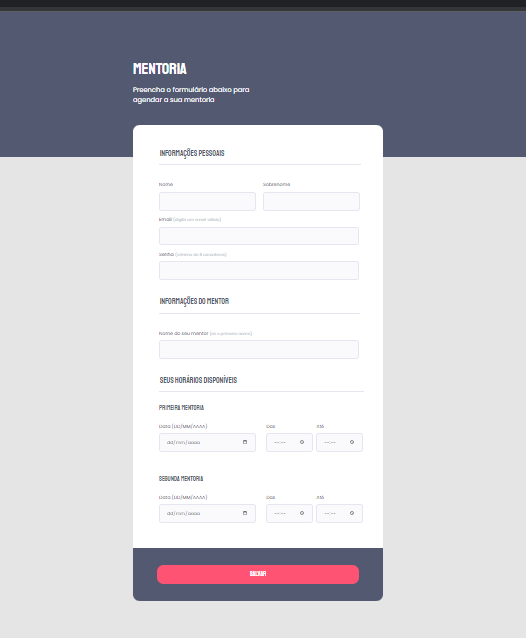

# Criando formulários | Explorer Stage 3

### Essa tarefa faz parte do curso Explorer da [Rocketseat](https://www.rocketseat.com.br).

Nessa atividade foi criado o formulário com foco em:

- Novos conceitos de tags HTML, como input e label;
- Novos conceitos em CSS com ênfase na customização e destaque do  header, inputs e botão;

## 🔖 Layout 

Figma do projeto disponível nesse [Link](<https://www.figma.com/file/nYq4gOzH03EvDHLyb0LS0k/Stage-03---Formul%C3%A1rio-intermedi%C3%A1rio-(Copy)?node-id=0%3A1&mode=dev>).

## 👩‍💻 Demonstração 

Caso deseje visualizar o funcionamento do formulário, basta clicar neste [link](<https://codepen.io/Dayane-Fernandes/pen/gOqqPYX>).